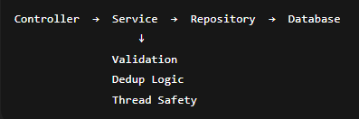

# Factory Events Backend System

## Overview

This project implements a backend system that ingests machine events from a factory, stores them safely under concurrent load, and exposes statistical APIs to analyze machine and production line performance over time.

The system is designed with correctness, thread safety, and performance as primary goals, following standard enterprise Spring Boot practices.

---

## Tech Stack

- Language: Java 17  
- Framework: Spring Boot 3.2.x (Spring Framework 6)  
- Database: MySQL 8.x (InnoDB)  
- ORM: Spring Data JPA (Hibernate)  
- Build Tool: Maven  
- Testing: JUnit 5  
- Connection Pool: HikariCP  

---

## Architecture

The application follows a traditional layered architecture:
---



### Responsibilities

- **Controller layer**
  - Exposes REST APIs
  - Handles request/response mapping

- **Service layer**
  - Core business logic
  - Validation
  - Deduplication and update rules
  - Aggregation logic for statistics

- **Repository layer**
  - Database access using Spring Data JPA

- **Database**
  - Enforces data consistency
  - Handles concurrency using row-level locking

---

## Data Model

Each machine event is stored with the following key attributes:

- eventId (unique)
- eventTime (used for all queries)
- receivedTime (set by backend)
- machineId
- lineId
- factoryId
- durationMs
- defectCount

### Manufacturing hierarchy (assumption)

The assignment references factory-level and line-level statistics without defining them in the event schema.  
A realistic manufacturing hierarchy is assumed:

- A factory contains multiple lines  
- A line contains multiple machines  

This hierarchy is modeled explicitly using factoryId and lineId.

---

## Event Ingestion Logic

### Validation Rules

An event is rejected if:

- durationMs < 0  
- durationMs > 6 hours  
- eventTime is more than 15 minutes in the future  

Rejected events are not stored.

---

### Deduplication & Update Rules

Events are deduplicated using eventId:

| Scenario | Behavior |
|--------|----------|
| Same eventId + identical payload | Deduped (ignored) |
| Same eventId + different payload + newer receivedTime | Updated |
| Same eventId + different payload + older receivedTime | Ignored |

The database enforces uniqueness on eventId, making it the final authority.

---

## Thread Safety

The system is designed to be thread-safe under concurrent ingestion:

- Controllers and services are stateless
- A UNIQUE constraint on eventId prevents duplicate records
- Ingestion runs inside a transactional boundary
- MySQL InnoDB provides row-level locking
- Concurrent duplicate inserts are gracefully handled using exception handling

A dedicated concurrency test simulates 10 parallel ingestion requests to validate correct behavior under load.

---

## API Endpoints

### 1. Batch Ingestion

**POST** `/events/batch`

- Accepts a JSON array of events
- Processes validation, deduplication, and updates
- Returns counts of accepted, deduped, updated, and rejected events

---

### 2. Machine Stats

**GET** `/stats`

**Query parameters:**
- machineId
- start (inclusive)
- end (exclusive)

**Returns:**
- eventsCount
- defectsCount (ignoring defectCount = -1)
- avgDefectRate
- status (Healthy / Warning)

---

### 3. Top Defect Lines

**GET** `/stats/top-defect-lines`

**Query parameters:**
- factoryId
- from
- to
- limit (default: 10)

**Returns:**
- lineId
- totalDefects
- eventCount
- defectsPercent (defects per 100 events, rounded to 2 decimals)

---

## Performance Strategy

To meet the requirement of processing 1000 events in under 1 second, the following strategies are used:

- Single transaction per batch
- Database indexing on:
  - eventId (UNIQUE)
  - machineId + eventTime
  - factoryId + eventTime
- Stateless service design
- HikariCP connection pooling
- Database-driven concurrency control


## 6. Edge Cases & Assumptions

### Edge Cases Handled

- Events with `durationMs < 0` or greater than 6 hours are rejected.
- Events with `eventTime` more than 15 minutes in the future are rejected.
- `defectCount = -1` is stored but ignored in defect calculations.
- Query windows use `start` as inclusive and `end` as exclusive.

### Assumptions

- Each machine belongs to a production line, and each line belongs to a factory.
- The backend sets `receivedTime`; any client-provided value is ignored.
- Occasional counter inaccuracies during extreme race conditions are acceptable, while data consistency is strictly preserved.

Tradeoffs favor correctness and consistency over exact per-request counters.

---

## 7. Setup & Run Instructions

### Prerequisites

- Java 17
- MySQL 8.x
- Maven

### Database Setup

```sql
CREATE DATABASE factory_events;
```
mvn spring-boot:run

http://localhost:8080

---

##8. Improvements With More Time

With additional time, the following enhancements would be considered:

JDBC batch insert optimization for very large ingestion volumes.

Pagination and caching for statistics endpoints.

Additional metrics such as max and average duration.

Read replicas for analytics-heavy workloads.

OpenAPI / Swagger documentation.

More granular benchmarking across different payload sizes.

